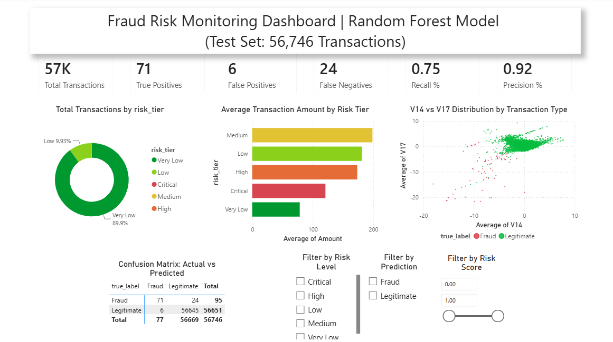
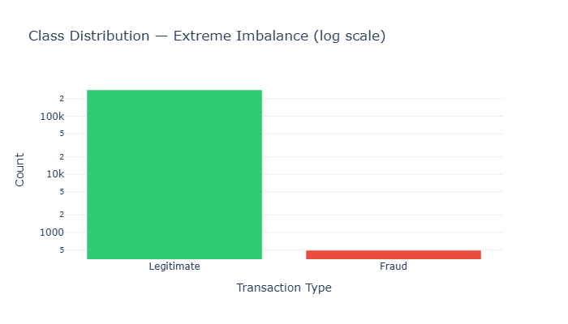
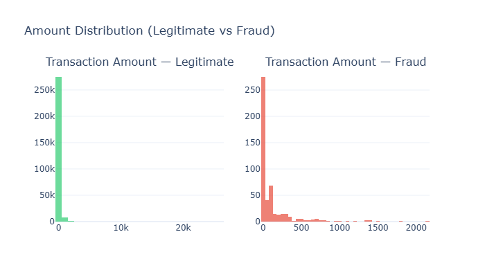
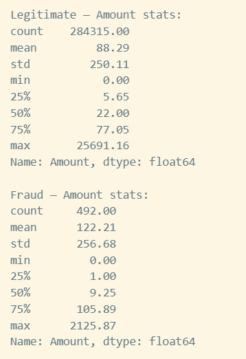
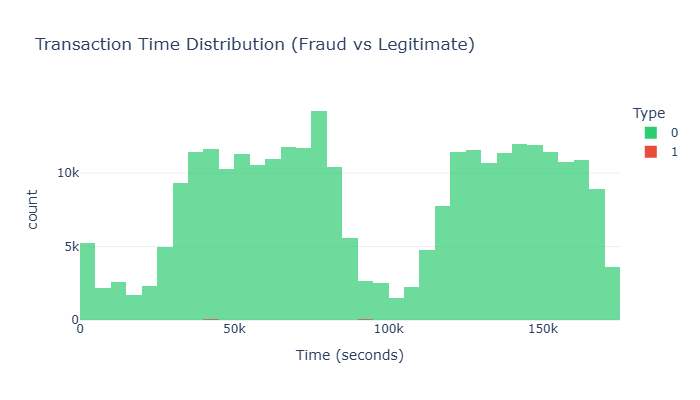
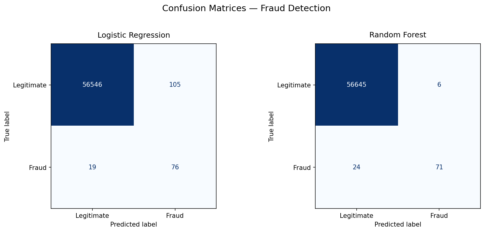
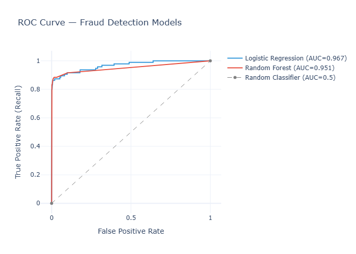
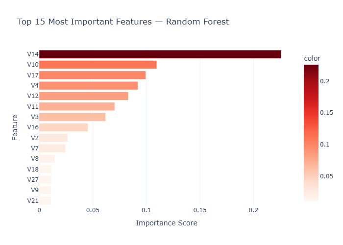

# Credit Card Fraud Detection using Machine Learning

## Problem
Maintaining customer trust is banks number one priority, catching fraud credit card transactions before it is confirmed confirmed is one way to achieve this. However, system's flaw of misinterpreting customers in false alarms and missing real fraud can be a fatal way of losing customers. Thus, the bank needs a great system that can accurately analyse whether the transaction is legit or fraud so that customer can gain trust and loyalty to the bank.


## Dataset

Download the dataset from:
- [Credit Card Fraud Detection Dataset — Kaggle](https://www.kaggle.com/datasets/mlg-ulb/creditcardfraud)


## References
- [Scikit-learn LogisticRegression Documentation](https://scikit-learn.org/stable/modules/generated/sklearn.linear_model.LogisticRegression.html)
- [Scikit-learn RandomForestClassifier Documentation](https://scikit-learn.org/stable/modules/generated/sklearn.ensemble.RandomForestClassifier.html)
- [Imbalanced-learn SMOTE Documentation](https://imbalanced-learn.org/stable/references/generated/imblearn.over_sampling.SMOTE.html)


## Architecture Diagram

```
┌──────────────────────────────────────────────────────────────────┐
│                       FRAUD DETECTION PIPELINE                   │
│                                                                  │
│  creditcard.csv                                                  │
│         │                                                        │
│         ▼                                                        │
│  ┌─────────────┐    ┌──────────────┐    ┌───────────────┐        │
│  │ Data        │    │ EDA &        │    │ Feature       │        │
│  │ Loading &   │───>│ Imbalance    │───>│ Scaling       │        │
│  │ Cleaning    │    │ Analysis     │    │ (Amount, Time)│        │
│  └─────────────┘    └──────────────┘    └───────┬───────┘        │
│                                                 │                │
│          ┌──────────────────────────────────────┘                │
│          ▼                                                       │
│  ┌─────────────┐    ┌──────────────┐    ┌───────────────┐        │
│  │ Train/Test  │    │ SMOTE        │    │ Train         │        │
│  │ Split       │───>│ (train set   │───>│ Classifiers   │        │
│  │ (stratified)│    │  only)       │    │ LR & RF       │        │
│  └─────────────┘    └──────────────┘    └───────┬───────┘        │
│                                                 │                │
│                                                 ▼                │
│                                   ┌─────────────────────┐        │
│                                   │ Evaluate            │        │
│                                   │ (Recall, Precision, │        │
│                                   │  ROC-AUC, Confusion │        │
│                                   │  Matrix)            │        │
│                                   └──────────┬──────────┘        │
│                                              │                   │
│                                              ▼                   │
│                                   ┌─────────────────────┐        │
│                                   │ Export to CSV       │        │
│                                   │ for Power BI        │        │
│                                   │ Dashboard           │        │
│                                   └─────────────────────┘        │
└──────────────────────────────────────────────────────────────────┘
```


## Tools Used
 - Python               ───> Programming language
 - Numpy                ───> Mathematical processing
 - Pandas               ───> Data processing and analysis
 - Scikit-learn         ───> StandardScaler, LogisticRegression, RandomForestClassifier
 - Imbalanced-learn     ───> SMOTE for handling class imbalance
 - Matplotlib / Seaborn ───> Static visualizations (confusion matrices)
 - Plotly               ───> Interactive visualization
 - Power BI             ───> Fraud-monitoring dashboard
 - Jupyter Notebook     ───> Development environment


## Model Details
1. **Feature Scaling** (cell 17) -> using `StandardScaler` to make all the feature have the same scale for a more valid analysis process. `Amount​` and `Time`, which previously ranged from zero to thousands on their raw data, are standardized so that mean = 0 and standard deviation = 1. They are both comparable to v1-v28, which do not require any standardisation process since they had gone through *PCA process*.

2. **Train/Test Split** (cell 17) -> splitting the data to 80% train set and 20% test set with `stratify=y` so that both sets keep the similar original ~0.17% fraud ratio and the test set stays completely untouched by any synthetic data.

3. **SMOTE Oversampling** (cell 20) -> generating synthetic fraud examples so fraud becomes roughly 10% of the majority class instead of its original 0.17% share. The fake fraud samples are the interpolations between existing fraud cases.

*SMOTE = Synthetic Minority Oversampling Technique, can only be used in training set (`sampling_strategy=0.1`) because **test set must represent the real condition** (no synthetic transaction)*
*The dataset is extremely imbalanced, consisting of only **0.17%** fraud transactions. A naive model can score **99.83% accuracy** while catching **zero fraud cases**.*

4. **Classifier Training** (cell 24) -> using `Random Forest` and `Logistic Regression` on the SMOTE-balanced training set:
   - `LogisticRegression(max_iter=1000, random_state=42)`
   - `RandomForestClassifier(n_estimators=100, random_state=42, class_weight='balanced')`

5. **Evaluation** (cell 27) -> because the accuracy is highly misleading on a 99.83/0.17 split, models are compared based on **Recall, Precision, F1-score, ROC-AUC, and the Confusion Matrix**. Recall is prioritized over precision with perspective of a missed fraud transaction being costlier to the bank than a false alarm.

> However, this trade-off isn't absolute, a model that misses a *few* fraud cases but avoids wrongly flagging a large number of legitimate customers can still be the better choice overall, it depends on the total of false alarms cost in customer trust and manual review effort required.

   
## Key Result

### 1. Dashboard Overview

*Combined view: KPI summary, Total Transaction by risk_tier, Average Transaction Amount by Risk Tier, Top V features distribution by Transaction, COnfusion Matrix, and the interactive filters.*

### 2. Overall Insights
- **The dataset has extreme imbalance** (492 fraud out of 284,807 transactions, ~578:1). Making a model out of it will make makes standard accuracy an unreliable metric. For example, the model which guess all the transaction as legitimate will get 99.83% accuracy even if it misses all the fraud transactions.
- Based on the [amount distribution](#2-amount-distribution) and [statistic table](#3-amount-statistics), fraud has a highly irregular distribution. Majority of the fraud transactions are in small amounts **(median $9)**,  but outliers ranges up to $2.1k. This irregularity might be caused by fraud's small sample size, which is why drawing strong conclusion from the amount pattern will be difficult. Hence. the model will not use `Amount` as main predictor.
- Fraud transactions  are distributed fairly uniformly across time with no obvious peak hours. This is shown in [the time distribution diagram](#4-time-distribution)
- From the feature importance (step 6), Features `V14`, `V17`, `V12`, and `V10` show the strongest separation between fraud and legitimate transactions.
- After SMOTE was applied to the training set, two models (`Logistic Regression` and `Random Forest`) are trained using the training set and then tested on the test set. The test set contains **56,651 legitimate transactions** and only **95 fraud transactions**, only **0.17%** fraud out of all transactions.
- Recall matters more than precision for this problem: catching more fraud is worth some extra false alarms. But take note that, this trade-off is not absolute, other scenario might happen.


### 3. Model Comparison

| Model | Fraud Caught (Recall) | Precision | False Alarms (False Positives) | F1-Score | ROC-AUC |
|---|---|---|---|---|---|
| Logistic Regression | 76 / 95 (**80%**) | **42%** | 105 | 0.55 | **0.9672** |
| Random Forest | 71 / 95 (**75%**) | **92%** | 6 | **0.83** | 0.9512 |

- **Logistic Regression**
  - Catches more fraud cases (5 additional frauds vs. Random Forest), which stops more losses before they happen.
  - Trade-off: flags many more legitimate transactions as fraud (105 false alarms), which increases customer friction and manual review workload.

- **Random Forest**
  - Much higher precision (92% vs 42%) — when it flags a transaction as fraud, it is very likely correct, and only 6 legitimate transactions are incorrectly blocked.
  - Trade-off: slightly lower recall, missing 5 more fraud cases than Logistic Regression.

- `Logistic Regression` -> best in **maximizing fraud detection**, which is the highest priority (detects 5 additional fraud cases).
- `Random Forest` -> by sacrificing only 5 fraud detections, it **reduces false alarms** from 105 to 6. This leads to a significantly better customer experience, fewer unnecessary account blocks, and lower operational costs.

 The 5 additional fraud cases `Logistic Regression` catches come at the cost of 99 extra false alarms. Every legitimate customer being wrongly flagged will damage trust and adds operational review costs. Thus, **unless the financial impact of the missed fraud cases is exceptionally high, `Random Forest` appears to offer the more practical solution for real-world deployment.**

- **Final model chosen: Random Forest** is selected for production/export because its high precision keeps false alarms (and customer friction) low, while still catching the large majority of fraud.

**Usage Recommendation:**
Exporting the `fraud_risk_score` and `risk_tier` columns enables a tiered decision making system, which has 4 risk levels. **Low-risk transactions (score 0.00–0.30) and Critical-risk transactions (score 0.80–1.00) can be automatically approved and blocked respectively**, since the model is highly confident. Then, **the fraud team will be in charge of the medium and high-risk transactions for manual review** before the final decision is made. This approach balances the fraud prevention with minimal disruption to the legitimate customers.

Missing fraud (false negative) is the costliest failure, and bank is responsible for reimbursing the customers for undetected fraud. As a result, `Recall` should be tracked as the primary monitoring metric on the Power BI dashboard. A decline in `Recall` can be considered as warning that the model might start missing more fraud cases. Thus, before there is huge financial impact, **monitoring false-negative counts every few days or weekly is suggested to trigger the operations team for model retraining. Periodic retraining with newly labeled fraud data will ensures the model stays relevant and maintains high Recall over time.**


## Screenshots

### 1. Class Distribution

*Legitimate vs. fraud transaction counts on a log scale, showing the ~578:1 imbalance.*

### 2. Amount Distribution

*The fraud `Amount` has outlier up to $2.1k*

### 3. Amount Statistics

*The fraud `Amount` transaction is small amount heavy with $9 mean but $106 at Q3.*

### 4. Time Distribution

*Time is distributed uniformly, no peak hours detected*

### 5. Confusion Matrices

*Side-by-side confusion matrices for Logistic Regression and Random Forest on the untouched test set.*

### 6. ROC Curve Comparison

*ROC curves for both models against a random-classifier baseline.*

### 7. Feature Importance

*Top 15 most important features from the Random Forest model.*

> Note: most plots in this notebook are interactive Plotly charts rendered inline. Only the confusion matrices are exported to `output/confusion_matrices.png`. Static screenshots for the other charts can be added here once exported.


## Future Improvements & Scalability

1. **Cost-sensitive / threshold tuning** - The current system uses a default classification threshold of 0.5, this can be further improved by customizing the decision threshold based on the real business cost of a false negative vs. a false positive. As a result, the model can push `Recall` higher without an unacceptable rise in the false alarms.
2. **Additional models** - Gradient boosting methods, such as`XGBoost`and `LightGBM`, and unsupervised anomaly detection like `Isolation Forest` and `Autoencoders` could be tested and compared against the current models to see if they offer a better precision/recall trade-off.
3. **Real-time scoring pipeline** - The current system will require manual input of new transactions data to be reanalyzed. In production environment, that can be further enhanced by deploying a real-time API scoring pipeline that feeds the `fraud_risk_score` directly into the bank's transaction-approval system.


## Installation & Usage

### 1. Clone the repository

If you have **not cloned the repository yet**, run:

```bash
git clone https://github.com/vionyp/data-analytics-portfolio.git
cd data-analytics-portfolio
```

### 2. (Optional) Create a virtual environment

Using a virtual environment is recommended to avoid dependency conflicts.

```bash
# Windows
python -m venv venv
venv\Scripts\activate

# macOS / Linux
python3 -m venv venv
source venv/bin/activate
```

### 3. Install the required dependencies

```bash
pip install -r requirements.txt
```

### 4. Download the dataset

The dataset is **not included** in this repository due to GitHub's file size limitations.

Download the dataset from:
- [Credit Card Fraud Detection Dataset — Kaggle](https://www.kaggle.com/datasets/mlg-ulb/creditcardfraud)

Place the downloaded file in:

```text
Fraud Detection (Classification)/
└── data/
    └── creditcard.csv
```

### 5. Run the notebook

```bash
jupyter notebook
```

Open:

```text
Fraud Detection (Classification)/notebook.ipynb
```

Run all cells sequentially.


## Reflection

This project was the most challenging among all the project I have worked on so far. Because of the extreme class imbalance (99.83% legitimate and 0.17% fraud), the model selection cannot simply rely on the standard accuracy as the evaluation metric. A model that predicts "legitimate" for every transaction and catches zero fraud would already achieve 99.83% accuracy but would be completely useless in practice. This is why I shifted the evaluation focus toward Recall, Precision, F1, and ROC-AUC. 

The main decision I struggled with was choosing **what to optimize for** in a problem where the two types of errors carry very different costs. As a bank, there are two conflicting goals. First is to catch as much fraud as possible **(high Recall)** in order to maintain customer trust in the bank's security.At the same time, minimizing false alarms **(high Precision)** to avoid disrupting legitimate customers with unnecessary transaction blocks is equally important. Mistaking real transactions for fraud frequently harms a bank's reputation just as severely as letting actual fraud slip through. This trade-off gave me a dilemma, I spent plenty of time before eventually choosing `Random Forest` over `Logistic Regression`.

As additional model options, I followed my friend's suggestion to explore `XGBoost` and `LightGBM` after finishing the whole project (that's why I added a few cells in the end after exporting data to csv). `XGBoost` did not achieve competitive results with 42% precision and 55% F1 score, while `LightGBM` achieved a slightly higher Recall (79%) than `Random Forest` (75%), catching 4 more fraud cases. However, it also generated 17 additional false alarms (23 vs 6), and its F1-score (78%) was lower than Random Forest's (83%).

In the end, I believe that the improvement of recovering 4 more fraud cases was not large enough to justify nearly four times more false alarms. In contrast, Random Forest provided the best overall balance between fraud detection capability and prediction reliability. Considering this trade-off, I believe Random Forest represents the most practical and business-oriented solution for this project. Nevertheless, in a real banking environment, the final decision should also consider the actual financial cost of missed fraud versus false alarms, as different institutions may prioritize security and customer experience differently. From this project, I learned that choosing the best machine learning model is not only by looking at the highest evaluation metrics, but also by understanding the business impact behind every prediction.
