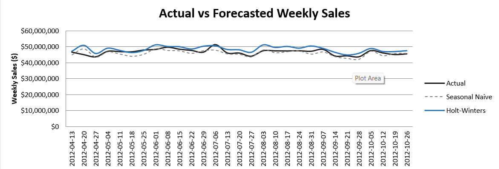
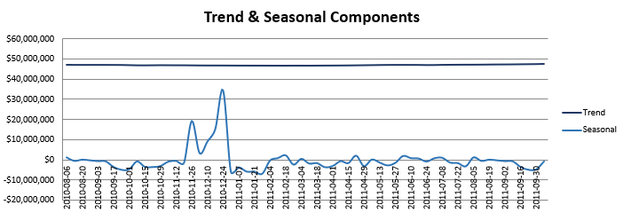
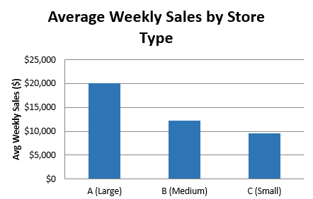
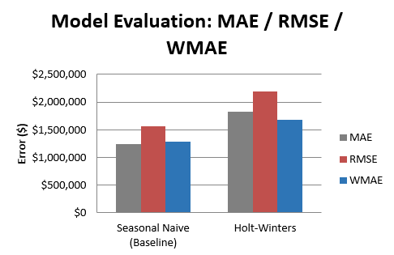

# Sales Forecasting on Walmart Store
### **Time Series Analysis**

## Problem
Shopping behaviour is influenced by seasonality, which significantly impacts Walmart's weekly sales, especially during the holiday season. Without an accurate forecasting system, stores risk poor inventory planning and staffing decisions. Thus, Walmart needs a system that can predict weekly sales from historical patterns, which is evaluated using **WMAE**.

*WMAE = Walmart's own competition metric. It weights holiday-week accuracy 5x higher than regular weeks because a bad forecast during Thanksgiving or Christmas is far costlier than one during an ordinary week*

## Dataset

Download the dataset from:
- [Walmart Recruiting - Store Sales Forecasting — Kaggle](https://www.kaggle.com/c/walmart-recruiting-store-sales-forecasting/data)


## References
- [Statsmodels seasonal_decompose Documentation](https://www.statsmodels.org/stable/generated/statsmodels.tsa.seasonal.seasonal_decompose.html)
- [Statsmodels Holt-Winters Exponential Smoothing Documentation](https://www.statsmodels.org/stable/generated/statsmodels.tsa.holtwinters.ExponentialSmoothing.html)


## Architecture Diagram

```
┌───────────────────────────────────────────────────────────────────┐
│                    SALES FORECASTING PIPELINE                     │
│                                                                   │
│  train.csv + stores.csv + features.csv                            │
│         │                                                         │
│         ▼                                                         │
│  ┌─────────────┐     ┌──────────────┐    ┌───────────────┐        │
│  │ Merge &     │     │ Exploratory  │    │ Chronological │        │
│  │ Clean       │ ───>│ Data         │───>│ Train/Test    │        │
│  │ Datasets    │     │ Analysis     │    │ Split (80/20) │        │
│  └─────────────┘     └──────────────┘    └───────┬───────┘        │
│                                                  │                │
│          ┌───────────────────────────────────────┘                │
│          ▼                                                        │
│  ┌─────────────┐     ┌──────────────┐    ┌───────────────┐        │
│  │ Trend &     │     │ Baseline     │    │ Holt-Winters  │        │
│  │ Seasonality │ ───>│ (Seasonal    │───>│ Exponential   │        │
│  │ Decompose   │     │ Naive)       │    │ Smoothing     │        │
│  └─────────────┘     └──────────────┘    └───────┬───────┘        │
│                                                  │                │
│                                                  ▼                │
│                                    ┌─────────────────────┐        │
│                                    │ Evaluation          │        │
│                                    │ (MAE, RMSE, WMAE)   │        │
│                                    └──────────┬──────────┘        │
│                                               │                   │
│                                               ▼                   │
│                                    ┌─────────────────────┐        │
│                                    │ Export Dashboard    │        │
│                                    │ to Excel (openpyxl) │        │
│                                    └─────────────────────┘        │
└───────────────────────────────────────────────────────────────────┘
```


## Tools Used
 - Python               ───> Programming language
 - Pandas               ───> Data processing and analysis
 - Statsmodels          ───> Seasonal decomposition, Holt-Winters Exponential Smoothing
 - Scikit-learn         ───> MAE / RMSE evaluation metrics
 - openpyxl             ───> Excel dashboard export and charting
 - Jupyter Notebook     ───> Development environment


## Model Details
1. **Merge & Clean Datasets** (cell 9) -> merging `train.csv` with `stores.csv` (adding `Type`, `Size`) and `features.csv` (adding `Temperature`, `Fuel_Price`, `CPI`, `Unemployment`, `MarkDown1`–`5`). `Date` is then converted to `datetime` and the data is sorted chronologically by Store, Dept, and Date. This step is often overlooked but sorting the data by date is critical because every step after this depends on the rows being in the correct time order. Missing markdown values are filled with 0, since they are treated as weeks with no promotion running.

2. **Chronological Train/Test Split** (cell 20) -> time series data must be split by **cutoff date**: everything before it is `train`, everything after is `test`. The data is split chronologically into 114 weeks of training data (Feb 2010–Apr 2012) and the final 29 weeks (Apr–Oct 2012, ~20% of the total) as the held-out test set. This is done to preserve the chronological order so that the model is never trained on data from the period it is being tested on.
*different from typical random split*

   > **Test set limitation:** the test period (Apr–Oct 2012) does not include November or December, so the model is never evaluated against Thanksgiving or Christmas week sales (even though they are shown in the EDA as the highest-sales weeks throughout the year). This happens because the dataset only spans ~2.7 years (Feb 2010–Oct 2012)(two full holiday seasons). Both `seasonal_decompose` and Holt-Winters (`seasonal_periods=52`) need at least two full annual cycles in their training data to run at all. Shifting the split earlier to include a holiday season in the test set would drop the training data below what these models need (2 full annual cycles). **A longer historical dataset (4–5 years) would be needed to properly evaluate holiday-week performance**.

3. **Trend & Seasonality Decomposition** (cell 23) -> decomposing the training series into *trend, seasonal,* and *residual* components using the `seasonal_decompose` (additive, `period=52`) only to the training series to confirm whether the data has a repeating yearly pattern before choosing a forecasting model.

4. **Baseline Model: Seasonal Naive** (cell 26) -> setting a baseline, which is a naive forecast that repeats the actual value from 52 weeks ago. The model is safe from data leakage, since the shifted window for the test period only reaches back into the training period. The start and the end of the test set are from April - October 2012, so the shift lands at April - October 2011, which is inside the training set.

5. **Forecasting Model: Holt-Winters Exponential Smoothing** (cell 29) -> `ExponentialSmoothing(trend='add', seasonal='add', seasonal_periods=52)`, **Holt-Winters model** is chosen because it explicitly models both trend and seasonality. This model is a solid fit for a weekly retail series with clear annual seasonality.

6. **Evaluation** (cell 31) -> comparing the baseline and Holt-Winters forecasts against actual test values using **MAE**, **RMSE**, and **WMAE** (Walmart's competition metric, weighting holiday weeks 5x).
*MAE = Mean Absolute Error*
*RMSE = Root Mean Squared Error*


## Key Result
### 1. Overall Insights
- During Holiday weeks, the average sales per Store-Department is **7.1% higher** than non-holiday weeks.
- From the [Top Weekly Sales](#1-top-weekly-sales) table, the highest-sales weeks of the year are expected to be around **pre-Christmas** [Week 51 (~18-24 Dec), avg ~26,396] and **Thanksgiving** [Week 47 (~20-26 Nov), avg ~22,221]. **December** has the highest-average month overall, followed by **November**.
*The test period does not include November and December, so the model never evaluated against Thanksgiving and Chirstmas week sales*
- As the largest-sized store, Store **Type A** has the highest-revenue segment (avg ~20,100/week, 22 stores). **Type C**, the smallest-sized store, has the smallest revenue (avg ~9,520/week, 6 stores). Logically,arger stores require higher revenue to offset their greater rent and overhead costs, which are predictably higher than those of smaller locations. The trend details is shown in the [Store Type Summary](#3-store-type-summary).
- Decomposition shows a nearly flat trend (~46.7M–47.5M) with a large seasonal swing (-7M to +34M relative to trend) and very small residual noise (~293K, only ~0.6–0.7% of the weekly sales scale). The trend statistics explain that Walmart is neither growing nor declining (no explicit expansion or signs of bankruptcy), suggesting a mature business with relatively stable yearly performance. The seasonality alone explains a highly consistent annual seasonal pattern. *but the analysis cannot be based on these mere numbers because inflation might happen and change the number scales.*

### 2. Model Comparison

| Model | MAE | RMSE | WMAE |
|---|---|---|---|
| Seasonal Naive (Baseline) | **1,247,205** | **1,562,916** | **1,285,948** |
| Holt-Winters | 1,825,402 | 2,192,359 | 1,676,779 |

The [Model Evaluation](#4-model-evaluation) diagram visualizes this comparison.
*Holt Winters model adapts to trend and smooths noise, while seasonal naive baseline just repeats the previous years*
- **Seasonal Naive (Baseline)** actually **outperforms** Holt-Winters on MAE/RMSE/WMAE in this test window. This finding should be addressed transparently and not overlooked as it might cause a fatal financial loss for the company.
- **The naive model wins can be logical:** the seasonal annual pattern is extremely stable (flat trend, low residual noise), so repeating the previous year's value can be a very strong forecast on its own. On top of that, a trend/seasonality-aware model like Holt-Winters can add its most value over a naive repeat during the holiday season, which is not included in this test window. With only ~2.7 years of history, fitting trends and seasonal parameters will be challenging for Holt-Winters model due to limited data. 
- WMAE and MAE are nearly identical for both models. If the test set included holiday weeks, that similarity could support the conclusion that neither model is failing specifically on holidays. However, since this test window contains zero holiday weeks, the metric's 5x holiday weighting have never been actually triggered. So this closeness is a mechanical result of the test set's composition, not evidence about holiday-week performance either way.


**Recommended usage:**
- With the current ~2.7 years of data, the **seasonal naive baseline is the safer choice for production**. The naive baseline is simpler, cheaper to maintain, and more accurate in this specific test set.
- If the business team really wants to trust Holt-Winters (the more complex model) over the baseline, **extending the historical data to 4–5 years** is recommended so that the test period include at least one full holiday season, guaranteeing that a smarter model is better.

The almost-flat trend and stable seasonal pattern suggests Walmart's total weekly sales are influenced by predictable calendar effects. This is useful for planning their inventory and staffing schedule around the known seasonal peak weeks, even before applying a more sophisticated model.


## Screenshots 
### a. From notebook
### 1. Top Weekly Sales
.png)
*Weeks with the 10 top average weekly sales*
.png)
*Months with the 10 top average weekly sales*

### b. From Excel Dasboard
### 1. Actual vs Forecasted Weekly Sales

*Line chart comparing actual weekly sales against both the seasonal naive and Holt-Winters forecasts over the test period.*

### 2. Seasonal Decomposition

*Trend, seasonal, and residual components plotted over time.*

### 3. Store-Type Summary

*Bar chart comparing average weekly sales, total sales, and store count across Types A, B, and C.*

### 4. Model Evaluation

*Bar chart comparing the seasonal naive and Holt-Winters forecasts based on MAE, RMSE, WMAE.*

> The dashboard is built directly as an Excel workbook using `openpyxl` (cell 34). The file titled `Walmart_Sales_Forecast_Dashboard_edited` is a more-presentable version (edited manually after being exported from the notebook)


## Future Improvements & Scalability

1. **Longer historical dataset (4–5 years)** - The current ~2.7 years of data does not allow the test period to cover a full annual cycle, and complex model like Holt-Winters does not have sufficient history to fit its seasonal parameters. Thus, more years of data would provide a more conclusive model comparison.
2. **SARIMA or Prophet** - `SARIMA` can manage multiplicative seasonality and changing seasonal patterns. `Prophet` can handle holiday effects automatically and more flexibly for inconsistent seasonal pattern than Holt-Winters. These models could be benchmarked against the current baseline once more data is available (point 1).
3. **Store/Department-level forecasting** - The current model forecasts only the aggregate total for all stores and departments. That forecast will not be as meaningful because every store and department has a diverse pattern, for example store with hot weather does not need as much jacket stocks as stores in colder area. Thus, for real production, the system would need to forecast at the Store–Dept level for each actionable inventory and staffing decisions.
4. **Incorporate external features** - The current models used are univariate time series models, so features like `Temperature`, `Fuel_Price`, `CPI`, `Unemployment`, and `MarkDown1`–`5` in the dataset cannot be used. To take benefits from those features, a regression-based or ML approach (e.g. XGBoost with lag features) is required because they can receive multiple inputs at once and catch unseen patterns from sales value only, potentially provide better accuracy.

These improvements were not implemented due to a combination of dataset limitations and scope constraints. The dataset itself only covers 2.7 years (Feb 2010 – Oct 2012), which does not allow models to be validly evaluated. `SARIMA` and `Prophet` were excluded to keep the project focused on core time series fundamentals (trend, seasonality, lag features, and chronological splitting). `Store/Department-level forecasting` was not applied since it is out of scope for a portfolio project (requiring training 4,455 separate models (45 stores × 99 departments)), even though it will be crucial for a production environment. Finally, `external features` could not be used by Holt-Winters that only accepts a single time series as input. 


## Reflection

The first mistake I made was spliting the train/test dataset for time series data. Having been so accustomed to using random train-test splits in previous projects, my muscle memory initially told me to do the same. After switching to chronological split (train on everything before a cutoff date, test on after), I realized that this step is extremely crucial design decision in the overall project since spliting it randomly would leak the future data during training and produce artificial performance. Thus, getting this step wrong would make every evaluation metric look better than it actually is, which might not be noticeable.

During the feature engineering stage, I thought that the `feature.csv` data will be important and I decided to merge features from the three files, which are `train.csv`, `store.csv` and `feature.csv`, before realizing that the forecast models being evaluated are univariate model that can only accept a single input, so all the external features from `feature.csv` and `store.csv` were not used for model evaluation. However, majority of those features were not completely wastes, they contributed to the EDA process. It showed that the bigger the store size is the higher the average weekly sales is. Additionally, different approach such as XGBoost with lag feature would take more advantage out of those external features. I included that approach on the future improvement section due to the insufficient data limitation.

Even though at first I expected that Holt-Winters, which models trends and seasonality, to outperform the seasonal naive baseline. Now,I have learned that the more complex, "smarter-sounding" model is not always the better choice. In this case, the dataset gives the seasonal naive baseline chance to have lower MAE, RSME, and WMAE since the holiday period was not included in the test set. Therefore, model selection should always be driven by evidence from the data rather than by model complexity or popularity. However, evaluating a model cannot rely on evaluation metrics alone, a lot of other things and factors need to be considered in the real production environment.
