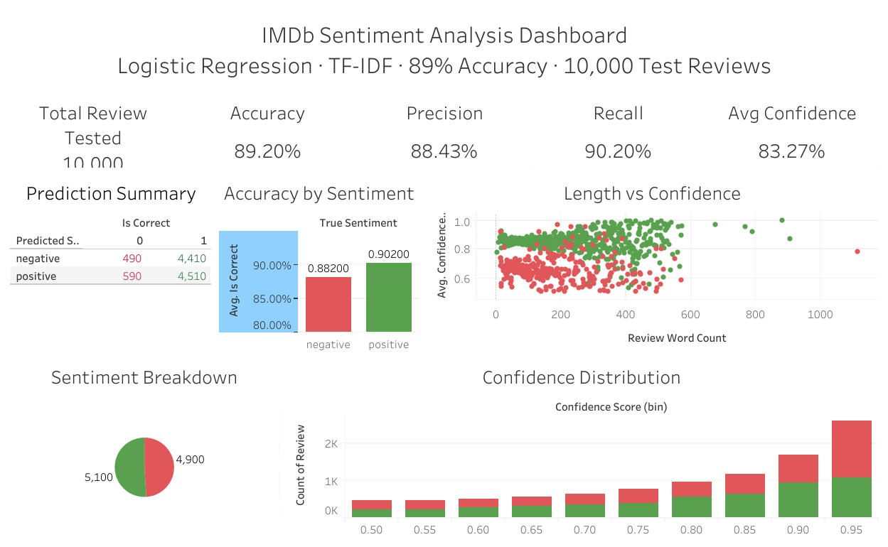
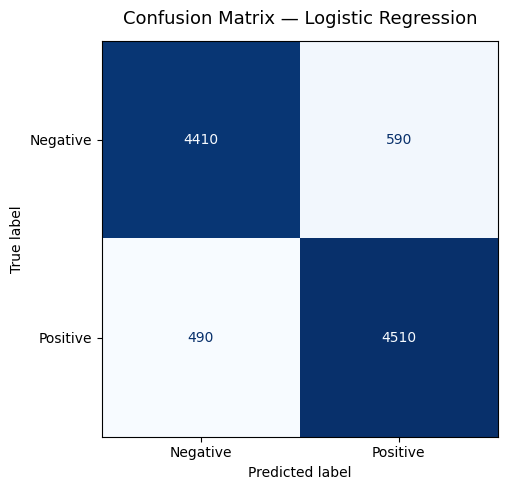
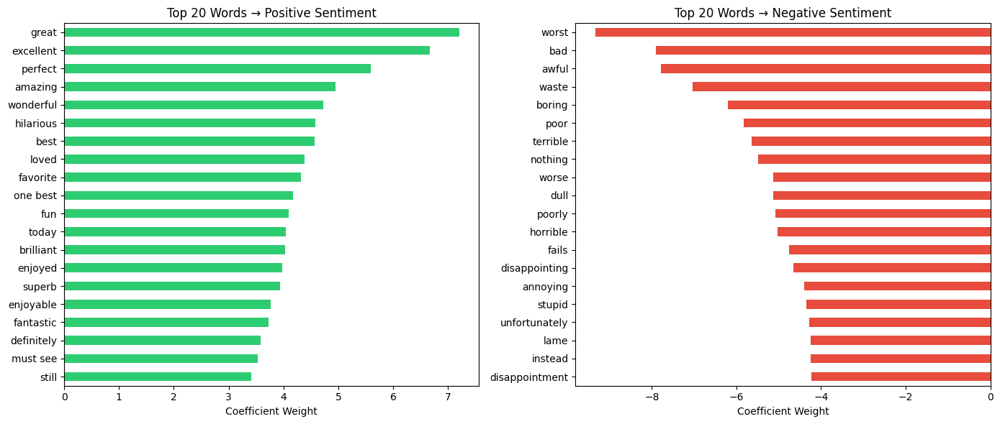

# Sentiment Analysis on IMDb Movie Reviews
### **Natural Language Processing (NLP) — Text Classification**

**[View Live Interactive Dashboard on Tableau Public](https://public.tableau.com/views/IMDbSentimentAnalysisDashboard/Dashboard1?:language=en-US&:sid=&:redirect=auth&:display_count=n&:origin=viz_share_link)**


## Problem
Measuring overall sentiment by reading through customer reviews manually is such a waste of time. So, a studio platform wanted an automation to classify movie reviews as positive or negative. Then, negative feedback can be flagged automatically and sentiment trends can be tracked at scale.


## Dataset

Download the dataset from:
- [IMDb Dataset of 50K Movie Reviews — Kaggle](https://www.kaggle.com/datasets/lakshmi25npathi/imdb-dataset-of-50k-movie-reviews)


## References
- [Scikit-learn TfidfVectorizer Documentation](https://scikit-learn.org/stable/modules/generated/sklearn.feature_extraction.text.TfidfVectorizer.html)
- [Scikit-learn LogisticRegression Documentation](https://scikit-learn.org/stable/modules/generated/sklearn.linear_model.LogisticRegression.html)
- [NLTK Documentation](https://www.nltk.org/)


## Architecture Diagram
```
┌──────────────────────────────────────────────────────────────────┐
│                        NLP PIPELINE                              │
│                                                                  │
│  IMDb Dataset (50K reviews)                                      │
│         │                                                        │
│         ▼                                                        │
│  ┌─────────────┐    ┌──────────────┐    ┌───────────────┐        │
│  │ Data        │    │ Text         │    │ TF-IDF        │        │
│  │ Loading &   │───>│ Cleaning     │───>│ Vectorization │        │
│  │ EDA         │    │ (HTML strip, │    │ (10,000       │        │
│  │             │    │ lemmatize)   │    │  features)    │        │
│  └─────────────┘    └──────────────┘    └───────────────┘        │
│                                                 │                │
│         ┌───────────────────────────────────────┘                │
│         ▼                                                        │
│  ┌─────────────┐    ┌──────────────┐    ┌───────────────┐        │
│  │ Train &     │    │ Model        │    │ Export to     │        │
│  │ Compare     │───>│ Evaluation   │───>│ CSV (Tableau) │        │
│  │ (LR vs NB)  │    │ (best: LR)   │    │               │        │
│  └─────────────┘    └──────────────┘    └───────────────┘        │
│                                                 │                │
│                                                 ▼                │
│                                    ┌─────────────────────┐       │
│                                    │ Business            │       │
│                                    │ Implications        │       │
│                                    │ (automated flagging)│       │
│                                    └─────────────────────┘       │
└──────────────────────────────────────────────────────────────────┘
```


## Tools Used
- Python                   ───> Programming language
- Pandas                   ───> Data processing and analysis
- NLTK                     ───> Text cleaning (stopwords, lemmatization)
- Scikit-learn             ───> TF-IDF vectorization, Logistic Regression, Naive Bayes
- Matplotlib               ───> Confusion matrix & top-words visualization
- Tableau                  ───> Interactive dashboard for exploring predictions
- Jupyter Notebook         ───> Development environment


## Model Details
1. **Data Preprocessing (NLP)** (cell 10-11) -> removing leftover HTML tags, punctuation, and numbers; lowercase, remove stopwords using NTLK, tokenize, and lemmatize each review. This process is done to *remove redundant words* and letters for model efficiency.

2. **Train/Test Split** (cell 14) -> spliting the data to 80% train set and 20% test set with `stratify=y` so that both sets keep a similar positive/negative ratio and the test set stays fully unseen by the model during training.

3. **TF-IDF Vectorization** (cell 15-16) -> converting each review into a vector of numbers using `max_features=10000` (top 10,000 most informative words/bigrams), weighting words by how distinctive they are to a review.
*TF = Term Frequency ~ how often a word appears in that review*
*IDF = Inverse Document Frequency ~ how rare the word is for all reviews*

4. **Train & Compare Classifiers** (cell 24-25) -> training two models on the same TF-IDF features for model comparison. The result is `Logistic Regression`(89.2%) scored higher than `Naive Bayes`(86.64%). Hence, `Logistic Regression` is used for the final model.

5. **Evaluation** (cell 21-23) -> evaluating the chosen model using Precision, Recall, F1-score, and a Confusion Matrix. Model coefficients also show the strongest positive/negative predictors.


## Key Result

### 1. Dashboard Overview

*Combined view: KPI summary, accuracy by sentiment, length vs confidence, sentiment breakdown, and confidence distribution .*

**[The interactive version on Tableau Public](https://public.tableau.com/views/IMDbSentimentAnalysisDashboard/Dashboard1?:language=en-US&:sid=&:redirect=auth&:display_count=n&:origin=viz_share_link)** ~ filter by sentiment, hover for details, and drill into individual predictions.

### 2. Overall Insights
- **`Logistic Regression` achieved 89.2% accuracy** on the 10,000-review test set, it has 2.6% higher accuracy compared to `Naive Bayes`.
- Precision and Recall are balanced across both classes (~0.88–0.90). This indicates that the model is not biased toward either sentiment. However, the model achieves slightly higher Recall on Positive reviews (0.90 vs 0.88) because positive sentiment tends to use more explicit words, but negative reviews often rely on negation and sarcasm. Those are harder patterns for TF-IDF to fully capture.
- Review length is **not** a meaningful predictor of sentiment (positive ~118 words vs negative ~122 words on average -> only 4 words difference) *TF-IDF word content as the modeling signal is validated*
- **The dataset is nearly balanced** (51% negative & 49% positive), so no extra complex techniques required for severe class imbalance.

### 3. Top Predictive Words
- **`Positive`:** great, excellent, perfect, amazing, wonderful, hilarious, best, loved
- **`Negative`:** worst, bad, awful, waste, boring, poor, terrible, nothing

### 4. Business Implications
- Since reading reviews manually is tedious and time-consuming, this model can be used for **automated review monitoring** at scale to save time and company's operational costs. Negative reviews can be **auto-flagged** for customer service or content follow-up. In addition to that, tracking sentiment trends faster can help provide early warning system.
- The `confidence_score` column allows low-confidence predictions to be flagged for human review instead of trusting every prediction equally. This column enables a more reliable human-in-the-loop pipeline.


## Screenshots

### 1. Confusion Matrix

*The model is not systematically biased toward one class, proven by the error rate which is roughly symmetric across both classes (590 false positives vs 490 false negatives).*

### 2. Top Predictive Words

*Top 20 words that are analyzed to be the keywords for positive vs negative predictions, ranked by model coefficient weight.*


## Future Improvements & Scalability

This current system already achieves high accuracy (89.2%). For production deployment, the following improvement can be further applied:

- **BERT fine-tuning** - By using BERT (a more advanced AI model compared to TF-IDF), the model accuracy is expected to increase by ~3-4%. This is because BERT understands word context and can deal with negation and sarcasm well.
- **Real-time API** - The current system requires manual input of new reviews to be reanalyzed. That can be further enhanced by converting the batch pipeline to a streaming service (e.g. FastAPI) for live review scoring as new reviews come in.
- **Confidence-based routing** - Regardless of the confidence score, the current pipeline treats all predictions equally. Low-confidence predictions can be automatically routed to human for further review. Having human inside the AI model pipeline will make the analysis more thorough and the overall pipeline more reliable.
- **Multi-class sentiment** -  Classifying the class further beyond positive/negative to a 1-5 star scale for more granular insight into the audience reception.
- **Aspect-based sentiment** - The current model can only assign one overall label for each review. By identifying *which part* of the review is positive or negative (acting, plot, pacing),content creators are provided with more specific and actionable feedback.

These improvements were not implemented in this project due to scope and resource constraints. `BERT fine-tuning` requires GPU access and longer training time, `Real-time API` and `Confidence-based routing` require production environment with live incoming data.


## Installation & Usage

### 1. Clone the repository

If you have **not cloned the repository yet**, run:

```bash
git clone https://github.com/vionyp/data-analytics-portfolio.git
cd data-analytics-portfolio
```

### 2. (Optional) Create a virtual environment

Using a virtual environment is recommended to avoid dependency conflicts.

```bash
# Windows
python -m venv venv
venv\Scripts\activate

# macOS / Linux
python3 -m venv venv
source venv/bin/activate
```

### 3. Install the required dependencies

```bash
pip install -r requirements.txt
```

### 4. Download the dataset

The dataset is **not included** in this repository due to GitHub's file size limitations.

Download the dataset from:
- [IMDb Dataset of 50K Movie Reviews — Kaggle](https://www.kaggle.com/datasets/lakshmi25npathi/imdb-dataset-of-50k-movie-reviews)

Place the downloaded file in:

```text
Sentiment Analysis (NLP)/
└── data/
    └── IMDB Dataset.csv
```

### 5. Run the notebook

```bash
jupyter notebook
```

Open:

```text
Sentiment Analysis (NLP)/notebook.ipynb
```

Run all cells sequentially.


## Reflection

At first, when I was comparing the two models, I assumed that `Naive Bayes` would have better performance compared to `Logistic Regression` for this sentiment analysis project. As a probabilistic model, `Naive Bayes` can calculate the likelihood of where each word belongs to a sentiment class, which makes it more intuitive for text classification process (each word contributes individually to the overall sentiment).

I felt something was off after re-reading, re-running, and re-checking the result multiple times. From what I knew,`Logistic Regression` is the statistical model that learns a weighted combination of all features, and it had consistently outperformed `Naive Bayes` (89.2% vs 86.6%). This peculiarity guided me to study and do deeper research on both models through external resources to understand how this could happen.

I found out that `Naive Bayes` makes **independence assumption**. It assumes that each words in a sentence is completely unrelated to one another, for example 'not good' is treated as separate signals which are 'not' and 'good'. This assumption made by `Naive Bayes`often does not hold in practice for sentiment analysis due to the matters of word context. In fact, in some cases like spam detection, medical diagnosis, and document categorization, `Naive Bayes` can work perfectly. On the other hand, `Logistic Regression` learns the combined weight of all features together, that includes bigrams as a single feature. This is why `Logistic Regression` could better interpret the relationship between words in each review, particularly when the negation is present.

This project taught me that the best model can be different across different cases and its selection cannot be based on mere intuition. Even though `Naive Bayes` felt like natural choice for text classification, its independence assumption proved otherwise since sentiment language is heavily context-dependent. To know which model performs better in practice, it is important to understand the underlying assumptions of each algorithm. Thus, I learned to always test multiple models on the actual data instead of assuming based on the theory.

