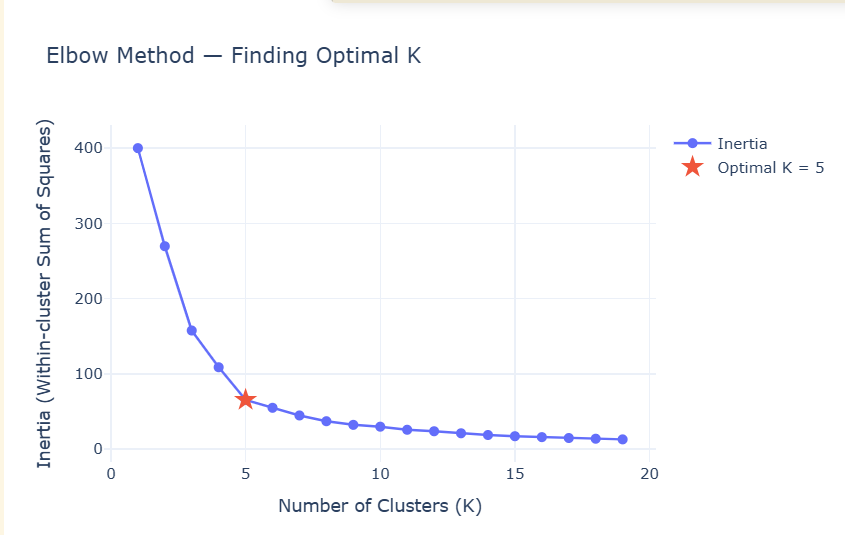
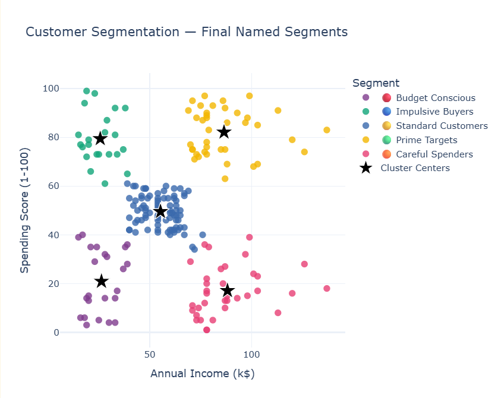
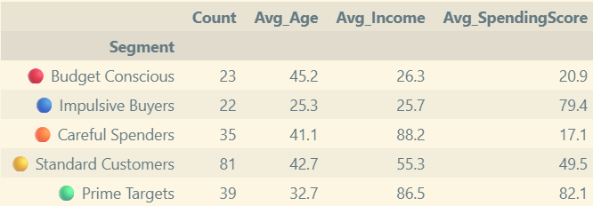
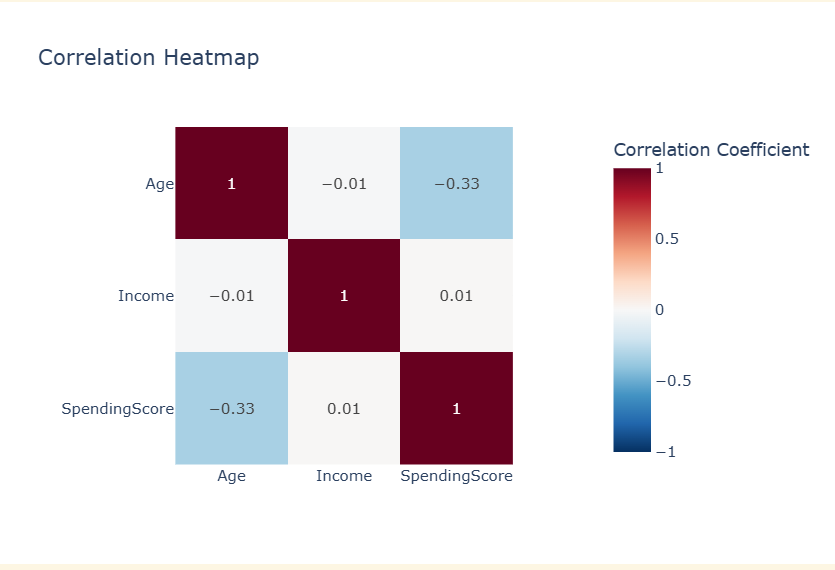

# Customer Segmentation using K-Means Clustering 


## Problem 
 The mall manager wants to understand their customer base for planning his targeted marketing strategies. Instead of giving generic promotions, which wastes the marketing budget, grouping customers can help the manager to identify distinct personas and specify marketing approaches for each groups.

## Dataset

Download the dataset from:
- [Mall Customer Segmentation Dataset — Kaggle](https://www.kaggle.com/datasets/vjchoudhary7/customer-segmentation-tutorial-in-python)


## References
- [Scikit-learn KMeans Documentation](https://scikit-learn.org/stable/modules/generated/sklearn.cluster.KMeans.html)
- [K-Means Clustering Explained](https://en.wikipedia.org/wiki/K-means_clustering)


## Architecture Diagram

```
┌─────────────────────────────────────────────────────────────┐
│                     DATA PIPELINE                           │
│                                                             │
│  Mall_Customers.csv                                         │
│         │                                                   │
│         ▼                                                   │
│  ┌─────────────┐     ┌──────────────┐    ┌───────────────┐  │
│  │ Data        │     │ Feature      │    │ StandardScaler│  │
│  │ Loading &   │ ───>│ Selection    │───>│ (normalize    │  │
│  │ EDA         │     │ Income +     │    │  Income &     │  │
│  │             │     │ SpendingScore│    │ SpendingScore)│  │
│  └─────────────┘     └──────────────┘    └───────┬───────┘  │
│                                                  │          │
│          ┌───────────────────────────────────────┘          │
│          ▼                                                  │
│  ┌─────────────┐     ┌──────────────┐    ┌───────────────┐  │
│  │ Elbow       │     │ K-Means      │    │ Cluster       │  │
│  │ Method      │ ───>│ Clustering   │───>│ Visualization │  │
│  │ (find K)    │     │ K = 5        │    │ (Plotly)      │  │
│  └─────────────┘     └──────────────┘    └───────┬───────┘  │
│                                                  │          │
│                                                  ▼          │
│                                    ┌─────────────────────┐  │
│                                    │ Business            │  │
│                                    │ Interpretation      │  │
│                                    │ (5 personas)        │  │
│                                    └─────────────────────┘  │
└─────────────────────────────────────────────────────────────┘
```


## Tools Used
 - Python               ───> Programming language
 - Numpy                ───> Mathematical processing
 - Pandas               ───> Data processing and analysis
 - Scikit-learn         ───> StandardScaler, KMeans algorithm
 - Plotly               ───> Interactive visualization
 - Jupyter Notebook     ───> Development environment


## Model Details
1. **Feature Scaling** (cell 16) -> using the `StandardScaler` to equalize the scale (Income​ is in thousands (15-137k) while `SpendingScore` is in range of 1 to 99) to mean=0, std=1. This is done to optimize the K-Means Clustering later since K-Means relies on Euclidean distance

2. **Elbow Method** (cell 19) -> plotting the inertia or WCSS (WIthin-Cluster Sum of Squares) from K range 1 to 19 to find the optimal K value

3. **K-Means Clustering** (cell 22) -> clustering the data into 5 groups using these parameters: n_clusters=5 (number of clusters, the K-value from elbow method), random_state=42 (for reproducibility), and n_init=10 (runs the algorithm 10 times with different random starts, then keep the best result).

4. **Inverse Transform** (cell 22) -> converting the cluster centers to their original scale (undoing what is done during the Feature Scaling process). Note: Only the cluster centers are inversed-transformed (not the individual customer data) for business interpretation.


## Key Result
### 1. Overall Insights
- Customer spending behavior is not solely determined by income. ([→ see heatmap](#4-correlation-heatmap))
- Customers with similar income levels can exhibit different spending patterns.
- Five distinct customer segments were identified using K-Means clustering.([→ see plot](#2-customer-segmentation))
- Segment-specific marketing strategies are more effective than a one generic approach.
- High-income customers are not always the highest spenders, indicating untapped revenue opportunities.

→ [See all diagrams in Screenshots section](#screenshots)

### 2. Recommendations

| Cluster | Segment | Avg Income | Avg Spending Score | Avg Age | Count |
|---------|---------|------------|-------------------|---------|-------|
| 🟡 Standard Customers | Medium Income, Medium Spending | ~$55k | ~49 | 42.7 | 81 |
| 🟢 Prime Targets | High Income, High Spending | ~$86k | ~82 | 32.7 | 39 |
| 🔵 Impulsive Buyers | Low Income, High Spending | ~$26k | ~79 | 25.3 | 22 |
| 🟠 Careful Spenders | High Income, Low Spending | ~$88k | ~17 | 41.1 | 35 |
| 🔴 Budget Conscious | Low Income, Low Spending | ~$26k | ~20 | 45.2 | 23 |

- **Prime Targets (High Income, High Spending)**
  - Most valuable customer segment with the highest revenue potential.
  - Recommended strategies:
    - VIP rewards programs
    - Exclusive promotions and events
    - Personalized product recommendations

- **Careful Spenders (High Income, Low Spending)**
  - Strong purchasing power but spend cautiously.
  - Recommended strategies:
    - Value-based marketing
    - Quality guarantees
    - Personalized offers highlighting long-term benefits

- **Impulsive Buyers (Low Income, High Spending)**
  - Easily influenced by urgency-based promotions.
  - Recommended strategies:
    - Flash sales
    - Limited-time offers
    - Seasonal campaigns

- **Budget Conscious**
  - Price-sensitive customers with lower purchasing power.
  - Recommended strategies:
    - Budget-friendly bundles
    - Discount promotions
    - Clearance sales

- **Standard Customers**
  - Average income and spending behavior.
  - Recommended strategies:
    - Loyalty programs
    - Cross-selling
    - Upselling campaigns

Applying targeted marketing strategies for each segment can improve customer engagement, maximize revenue, and strengthen long-term customer relationships.


## Screenshots

### 1. Elbow Curve

*Inertia drops sharply until K=5, then becomes stable. So, K=5 is selected as the optimal value*

### 2. Customer Segmentation

*Each persona is represented with different colours. The stars are the cluster centers*

### 3. Cluster Profile Summary

*Segment breakdown with average income, spending score, and age per cluster*

### 4. Correlation Heatmap

*Income and SpendingScore are independent variables (ideal for 2D clustering)*


## Installation Details
> Coming soon — installation guide will be added after repository setup.


## Future Improvements & Scalability

1. **DBSCAN for alternative clustering method** - The reallife datasets with irregular cluster shapes and significant outliers would be better handled by DBSCAN. This project dataset is good enough and has spherical and same-sized clusters which can be managed with K-means method.
2. **RFM-based segmentation** - The Data Transaction used is not complete, real transaction dataset would have more complete information, such as Recency, Frequency, Monetary, etc. So it can produce a more accurate segmentation.
3. **Real time scoring pipeline** - The current system will require manual input of new customer data to be reanalyzed. That can be further enhanced by deploying a scoring pipeline that have real-time API which can assign new customer to those 5 segments automatically.


## Reflection 

During the feedback session, I was asked why `Age` and `Gender` were not included in the clustering process. Initially, I was confident that excluding `Gender` was the right decision, as encoding male and female as numerical values (e.g., 0 and 1) would introduce an artificial distance relationship that K-Means, which relies on Euclidean distance, would incorrectly interpret as meaningful.

Regarding `Age`, my initial reasoning was that including it might cause the algorithm to form age-based clusters rather than spending behavior clusters. I felt that this did not align with the business objective of identifying customer segments based on purchasing power and spending behavior. I also assumed that its relatively low correlation with the other variables suggested that it would contribute little to the clustering process.

The discussion gave me a different perspective on this decision. Although the clustering objective should remain focused on customer behaviour, I realized that removing the `Age` feature entirely would also mean losing valuable contextual information. Instead of using it as an input feature, I found that `Age` was more informative as a post-hoc descriptive feature. This approach preserved the original segmentation objective while making the results easier to interpret. For example, *Impulsive buyers* group is dominated with younger customers, as can be seen in the [Cluster Profile Summary](#3-cluster-profile-summary).

This project taught me that feature selection is not only about deciding whether a feature should be included or excluded. Another important thing to consider is how a feature can contribute most effectively to the analysis. In this project, using `Age` as an interpretative feature provided richer business insights without changing the original behaviour-based segmentation objective.
